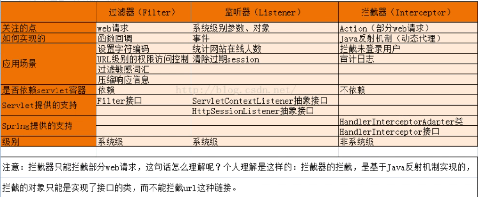
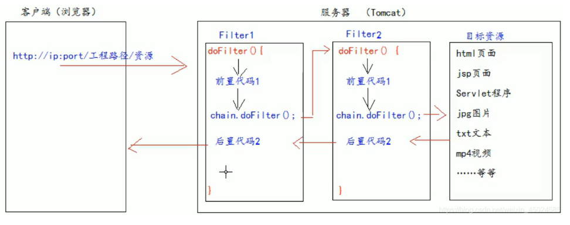

# SpringBoot日志

# SpringMvc配置

WebMvcConfigurationSupport

~~~java

/** 解决跨域问题 **/
public void addCorsMappings(CorsRegistry registry) ;

/** 添加拦截器 **/
void addInterceptors(InterceptorRegistry registry);

/** 这里配置视图解析器 **/
/** 视图跳转控制器 **/
void addViewControllers(ViewControllerRegistry registry);
void configureViewResolvers(ViewResolverRegistry registry);

/** 配置内容裁决的一些选项 **/
void configureContentNegotiation(ContentNegotiationConfigurer configurer);

/** 静态资源处理 **/
void addResourceHandlers(ResourceHandlerRegistry registry);

/** 默认静态资源处理器 **/
void configureDefaultServletHandling(DefaultServletHandlerConfigurer configurer);

~~~


# MyBatisPlus补充

MyBatisPlus不但在数据层实现了方便的接口，还在service层提供了可靠的接口。

service接口集成IService\<实体类\>，service实现类继承ServiceImpl\<M extends BaseMapper<T\> mapper类, T 实体类>


~~~java
public interface EmployeeService extends IService<Employee> {
}
~~~


~~~java
public class EmployeeServiceImpl extends ServiceImpl<EmpliyeeMapper, Employee> implements EmployeeService {
}
~~~


IService封装了可用的一些接口，ServiceImpl对接口的实现。


## 公共字段自动填充

### TableField

在实体类中为需要填充的字段添加@TableField注解，参数指定填充的时机。

~~~java
@Data
public class Employee implements Serializable {

    private static final long serialVersionUID = 1L;

    private Long id;

    private String username;

    private String name;

    private String password;

    private String phone;

    private String sex;

    private String idNumber;  // 身份证号

    private Integer status;

    @TableField(fill = FieldFill.INSERT)
    private LocalDateTime createTime;

    @TableField(fill = FieldFill.INSERT_UPDATE)
    private LocalDateTime updateTime;

    @TableField(fill = FieldFill.INSERT)
    private Long createUser;

    @TableField(fill = FieldFill.INSERT_UPDATE)
    private Long updateUser;

}
~~~


### 实现MetaObjectHandler接口

```java
@Component
@Slf4j
public class MyMetaObjectHanderler implements MetaObjectHandler {
    @Override
    public void insertFill(MetaObject metaObject) {
        metaObject.setValue("createTime", LocalDateTime.now());
        metaObject.setValue("updateTime",LocalDateTime.now());
        //如何获取Session，来设置id
        
    }

    @Override
    public void updateFill(MetaObject metaObject) {
        metaObject.setValue("updateTime",LocalDateTime.now());
    }
}
```


**注意：对每个属性进行判断，增加通用性。**如果不做判断，@TableField标签的类必须要有全部属性。


## 跨线程通信

客户端发送的每次http请求，对应的在服务端都会分配一个新的线程来处理，在处理过程中下面的类都属于同一个线程。

* Filter
* Controller
* ObjectHandler(类转json)

如何在线程中传递变量呢？


### ThreadLocal

ThreadLocal是Thread的局部变量。ThreadLocal为每一个使用改变量的线程提供独立的变量副本，所有每一个线程可以独立的改变自己的副本，而不影响其他线程，对其他线程隔离。


我们可以在LoginCheckFilter的doFilter方法中获取当前用户登录的id，并调用ThreadLocal报错id，然后在MyMetaObjectHandler中获取id


封装工具类

```java
/**
 * 基于ThreadLocal工具类
 */
public class BaseContext {
    private static ThreadLocal<Long> threadLocal = new ThreadLocal<>();

    public static void setCurrentId(Long id){
        threadLocal.set(id);
    }

    public static Long getCurrentId(){
        return threadLocal.get();
    }
}
```


## 分页Page


# 其他

## 通用返回类设计

~~~java
package com.tiheima.reggie.common;

import lombok.Data;

import java.util.HashMap;
import java.util.Map;

@Data
public class R<T> {
    private Integer code;

    private String msg;

    private T data;

    private Map map = new HashMap();// 动态数据

    public static <T> R<T> success(T object){
        R<T> r = new R<T>();
        r.data = object;
        r.code = 1;
        return r;
    }

    public static <T> R<T> error(String msg){
        R r = new R();
        r.msg = msg;
        r.code = 0;
        return r;
    }

    public R<T> add(String key, Object value){
        this.map.put(key,value);
        return this; 
    }
}
~~~

* data使用泛型控制而不是Object
* 增加一个Map存放动态数据
* 提供success和error方法返回对象，不能自己去new


## DigestUtils

Spring提供的加密工具类


## Cookie、Session和Token

TODO: Session 存储在哪里，怎么使用。


## ServletContext


## 过滤器、监听器、拦截器区别使用




过滤器和监听器是在tomcat层面上的配置，优先级是高于拦截器的。而拦截器是SpringMVC提供的通过IOP实现的底层是反射机制。


### 过滤器

过滤器是作用于servlet上的配置在tomcat层。


请求进入服务器，首先被过滤器的**前置代码拦截**，处理过后交给视图层也就是SpringMVC，业务处理完成后，回到过滤器的**后置代码拦截**最后返回给浏览器。

原理和拦截器一样，但是过滤器是作用在tomcat层，拦截一切请求。


~~~java
@Override
public void doFilter(ServletRequest servletRequest, ServletResponse servletResponse, FilterChain filterChain) throws IOException, ServletException {
    System.out.println("Filter1前置代码");
    filterChain.doFilter(servletRequest,servletResponse);
    System.out.println("Filter1后置代码");
}
~~~


业务实例：

~~~java
@Slf4j
@WebFilter(filterName = "loginCheckFilter",urlPatterns = "/*")
public class LoginCheckFilter implements Filter {
    // Spring提供的工具类，匹配路径
    public static final AntPathMatcher PATH_MATCHER = new AntPathMatcher();

    @Override
    public void doFilter(ServletRequest servletRequest, ServletResponse servletResponse, FilterChain filterChain) throws IOException, ServletException {
        HttpServletRequest request = (HttpServletRequest) servletRequest;
        HttpServletResponse response = (HttpServletResponse) servletResponse;
        log.info("拦截请求：{}",request.getRequestURL());

        String url = String.valueOf(request.getRequestURI());
        String[] urls = new String[]{
                "/employee/login",
                "/employee/logout",
                "/backend/**",
                "/front/**"
        };

        boolean check = check(urls,url);

        if(check){
            filterChain.doFilter(request,response);
            return;
        }

        if(request.getSession().getAttribute("employee") != null){
            filterChain.doFilter(request,response);
            return;
        }

        response.getWriter().write(JSON.toJSONString(R.error("NOTLOGIN")));
    }
~~~

本实例中没有后置处理，当需要在过滤器层面响应时，**首先通过json构造response，然后不调用filterChain.doFilter直接返回**


**在SpringBoot中启动类要配置@ServletComponentScan**





过滤器也是链式处理的。

**@Order(1)**表示如果有多个拦截器的话就是设置这个拦截器的运行等级，数字越小，越先执行


### 监听器

他存在于服务器的整个生命周期。可以监听**Session，request，ServletContextListener**的变化，当他们产生变化时，会触发监听方法。


#### Session

> session操作

```java
request.getSession().setAttribute("employee",emp.getId());
//在请求中添加session
request.getSession().removeAttribute("employee");
//删除浏览器中的session
request.getSession().invalidate();
//删除本地session

//获取值
//修改值
//添加值
//等等
```


> session监听

~~~java
@Slf4j
@WebListener
public class onLineCountListener implements HttpSessionAttributeListener,HttpSessionListener {
    public static int count = 0;

    @Override
    public void sessionCreated(HttpSessionEvent se) {
        count++;
        log.info("当前在线人数："+count);
    }

    @Override
    public void sessionDestroyed(HttpSessionEvent se) {
        count--;
        log.info("当前在线人数："+count);
    }

    @Override
    public void attributeAdded(HttpSessionBindingEvent se) {
        HttpSessionAttributeListener.super.attributeAdded(se);
    }

    @Override
    public void attributeRemoved(HttpSessionBindingEvent se) {
        HttpSessionAttributeListener.super.attributeRemoved(se);
    }

    @Override
    public void attributeReplaced(HttpSessionBindingEvent se) {
        HttpSessionAttributeListener.super.attributeReplaced(se);
    }
}
~~~

**添加@WebListener标签，在springboot启动类中添加@ServletComponentScan**


#### request

同理


#### ServletContextListener

同理


## 全局异常处理

原理是使用AOP思想的异常通知。

* 全局异常处理类@ControllerAdvice
* 处理方法上加上注解@ExceptionHandler(Exception.class)


### ControllerAdvice

本意是增强Controller，用作：全局异常处理、全局数据绑定、全局数据预处理。

标签属性有：

* basePackages

指定一个或多个包

~~~java
@RestControllerAdvice(basePackages={"top.onething"})
~~~


* basePackageClasses

指定类

~~~java
@RestControllerAdvice(basePackageClasses={TestController.class})
~~~


* assignableTypes

指定Controller类，这些类被ControllerAdvice管理

~~~java
@RestControllerAdvice(assignableTypes={TestController.class})
~~~


* annotations

指定一个或多个注解，被这些注解标记的Controller会被管理

~~~java
@ControllerAdvice(annotations = {TestAnnotation.class})
~~~


作为异常处理器，通常是需要伴随着响应内容的@ResponseBody可以将对象转化为json，配合ControllerAdvice一起使用。


- 结合`@ExceptionHandler`使用 ==> 添加统一的异常处理控制器方法
- 结合`@ModelAttribute`使用 ==> 使用共用方法添加渲染视图的数据模型属性
- 结合`@InitBinder`使用 ==> 使用共用方法初始化控制器方法调用使用的数据绑定器


~~~java
@ControllerAdvice  
public class GlobalController{  
     
    //（1）全局数据绑定
    //应用到所有@RequestMapping注解方法  
    //此处将键值对添加到全局，注解了@RequestMapping的方法都可以获得此键值对  
    @ModelAttribute 
    public void addUser(Model model) {   
        model.addAttribute("msg", "此处将键值对添加到全局，注解了@RequestMapping的方法都可以获得此键值对");  
    }    
    //（2）全局数据预处理
    //应用到所有@RequestMapping注解方法，在其执行之前初始化数据绑定器  
    //用来设置WebDataBinder  
    @InitBinder("user")
    public void initBinder(WebDataBinder binder) {
    }    
    
    // （3）全局异常处理
    //应用到所有@RequestMapping注解的方法，在其抛出Exception异常时执行  
    //定义全局异常处理，value属性可以过滤拦截指定异常，此处拦截所有的Exception  
    @ExceptionHandler(Exception.class)    
    public String handleException(Exception e) {    
        return "error";
    }    
}  
~~~


### 结合ExceptionHandler

- 优点：将 Controller 层的异常和数据校验的异常进行统一处理，减少模板代码，减少编码量，提升扩展性和可维护性。
- 缺点：只能处理 Controller 层未捕获（往外抛）的异常，对于 **Interceptor（拦截器）层的异常**，**Spring 框架层的异常**，就无能为力了。


对方法进行注解参数是异常类，方法参数也是异常类：

~~~java
@ExceptionHandler(SQLIntegrityConstraintViolationException.class)
public R<String> exceptionHandler(SQLIntegrityConstraintViolationException ex){
    log.error(ex.getMessage());

    if(ex.getMessage().contains("Duplicate entry")){
        String[] split = ex.getMessage().split(" ");
        String msg = split[2] + "已存在";
        return R.error(msg);
    }

    return R.error("失败");
}
~~~


直接在这里响应数据。


### 完整代码

~~~java
@ControllerAdvice(annotations = {RestController.class, Controller.class})
@ResponseBody
@Slf4j
public class GlobalExceptionHandler {

    @ExceptionHandler(SQLIntegrityConstraintViolationException.class)
    public R<String> exceptionHandler(SQLIntegrityConstraintViolationException ex){
        log.error(ex.getMessage());

        if(ex.getMessage().contains("Duplicate entry")){
            String[] split = ex.getMessage().split(" ");
            String msg = split[2] + "已存在";
            return R.error(msg);
        }

        return R.error("失败");
    }

}

~~~

annotations = {RestController.class, Controller.class}包含了所有的Contriller

@ResponseBody响应封装


## Long类型

js中的Long类型会丢失精度，在处理id时要报错。

**在服务器响应页面时将long性转成字符串。**


### 实现步骤

* 实现对象转换器JacksonObjectMapper，基于Jackson进行Java对象到json数据的转换。（构建一个新的转换器）
* 在WebMvcConfig配置类中扩展Spring Mvc消息转换器，在此消息转换器中使用提供的对象转换器进行Java对象到json数据的转换。（配置新的转换器替换Spring提供的）


### 创建Jackson

~~~java
/**
 * 对象映射器:基于jackson将Java对象转为json，或者将json转为Java对象
 * 将JSON解析为Java对象的过程称为 [从JSON反序列化Java对象]
 * 从Java对象生成JSON的过程称为 [序列化Java对象到JSON]
 */
//  将 较大值的Long类型数据 传到前端，可能会造成数值的精度丢失，将Long类型数据转化为字符串再传到前端就可以解决该问题
//  同时，在WebMvcConfig中 添加消息转换方法extendMessageConverters(List<HttpMessageConverter<?>> converters)
public class JacksonObjectMapper extends ObjectMapper {

    public static final String DEFAULT_DATE_FORMAT = "yyyy-MM-dd";
    public static final String DEFAULT_DATE_TIME_FORMAT = "yyyy-MM-dd HH:mm:ss";
    public static final String DEFAULT_TIME_FORMAT = "HH:mm:ss";

    public JacksonObjectMapper() {
        super();
        //收到未知属性时不报异常
        this.configure(FAIL_ON_UNKNOWN_PROPERTIES, false);

        //反序列化时，属性不存在的兼容处理
        this.getDeserializationConfig().withoutFeatures(DeserializationFeature.FAIL_ON_UNKNOWN_PROPERTIES);


        SimpleModule simpleModule = new SimpleModule()
                .addDeserializer(LocalDateTime.class, new LocalDateTimeDeserializer(DateTimeFormatter.ofPattern(DEFAULT_DATE_TIME_FORMAT)))
                .addDeserializer(LocalDate.class, new LocalDateDeserializer(DateTimeFormatter.ofPattern(DEFAULT_DATE_FORMAT)))
                .addDeserializer(LocalTime.class, new LocalTimeDeserializer(DateTimeFormatter.ofPattern(DEFAULT_TIME_FORMAT)))

                .addSerializer(BigInteger.class, ToStringSerializer.instance)
                .addSerializer(Long.class, ToStringSerializer.instance)
                .addSerializer(LocalDateTime.class, new LocalDateTimeSerializer(DateTimeFormatter.ofPattern(DEFAULT_DATE_TIME_FORMAT)))
                .addSerializer(LocalDate.class, new LocalDateSerializer(DateTimeFormatter.ofPattern(DEFAULT_DATE_FORMAT)))
                .addSerializer(LocalTime.class, new LocalTimeSerializer(DateTimeFormatter.ofPattern(DEFAULT_TIME_FORMAT)));

        //注册功能模块 例如，可以添加自定义序列化器和反序列化器
        this.registerModule(simpleModule);
    }
}
~~~


### 配置MVC

~~~java
@Configuration
public class WebMvcConfig extends WebMvcConfigurationSupport {
    /**
     * 扩展MVC框架的消息转换器
     * @param converters
     */
    @Override
    protected void extendMessageConverters(List<HttpMessageConverter<?>> converters) {
        //创建消息转换器对象
        MappingJackson2HttpMessageConverter messageConverter = new MappingJackson2HttpMessageConverter();
        //设置对象转换器
        messageConverter.setObjectMapper(new JacksonObjectMapper());
        //将上面的消息转换器对象追加到mvc框架的转换器集合中，并设置优先使用
        converters.add(0,messageConverter);
    }
}

~~~


## 关联删除

**关联删除为了代码简洁，不在Controller处理，在Service进行级联查询，不能删除的抛出异常，在全局异常处理中删除。**


### 自定义异常

~~~java
public class CustomException extends RuntimeException{
    public CustomException(String message){
        super(message);
    }
}
~~~


### 异常处理

~~~java
@ControllerAdvice(annotations = {RestController.class, Controller.class})
@ResponseBody
@Slf4j
public class GlobalExceptionHandler {

    @ExceptionHandler(CustomException.class)
    public R<String> exceptionHandler(CustomException ex){
        return R.error(ex.getMessage());
    }

}
~~~


### 异常抛出

~~~java
    @Override
    public void remove(Long id) {
        //查询当前分类是否关联了菜品，如果关联抛出异常
        LambdaQueryWrapper<Dish> dishLambdaQueryWrapper = new LambdaQueryWrapper<>();
        dishLambdaQueryWrapper.eq(Dish::getCategoryId,id);
        int count = dishService.count(dishLambdaQueryWrapper);
        //查询是否关联套餐
        if(count > 0){
            //抛出异常
            throw new CustomException("当前分类关联菜品不能删除");
        }

        LambdaQueryWrapper<Setmeal> setmealLambdaQueryWrapper = new LambdaQueryWrapper<>();
        setmealLambdaQueryWrapper.eq(Setmeal::getCategoryId,id);
        int count2 = setmealService.count(setmealLambdaQueryWrapper);
        if(count2 > 0){
            //抛出异常
            throw new CustomException("当前分类关联套餐不能删除");
        }
        super.removeById(id);
        //正常删除
    }
~~~


## 文件上传和下载

### 前提

前端使用form表单进行文件上传

* method = post
* enctype = multipart/dorm-data
* type = file


###  MultipartFile

在javaservlet中使用commons-fileupload、commons-io来进行文件上传操作。spring封装好了MultipartFile。


通常定义在CommonController而不在业务的Controller。


使用**UUID**重新生成文件名

#### Controller

~~~java
@RestController
@RequestMapping("/common")
@Slf4j
public class CommonController {

    @Value("${reggie.path}")
    private String basePath;

    @PostMapping("/upload")
    public R<String> upload(MultipartFile file){
        //file形参必须和传入表单的name一样
        //file是一个临时文件，需要转存到指定位置，否则本次请求完成后就会删除
        //转存file
        //使用UUID重新生成文件名
        String name = UUID.randomUUID().toString();
        //获取后缀
        String orignalName = file.getOriginalFilename();
        String suffx = orignalName.substring(orignalName.lastIndexOf("."));
        //文件名拼接
        String fileName = orignalName + suffx;
        //创建目录对象
        File dir = new File(basePath);
        if(!dir.exists()){
            dir.mkdirs();
        }

        log.info("文件上传{}：",basePath+file.getOriginalFilename());
        try {
            file.transferTo(new File(basePath+fileName));
        } catch (IOException e) {
            e.printStackTrace();
        }

        return R.success(fileName);
    }
}
~~~


### 文件下载

不需要响应对象，直接修改response通过输出流实现。

~~~java
@GetMapping("/download")
public void download(String name, HttpServletResponse response){
    //输入流读取文件内容
    try {
        FileInputStream inputStream = new FileInputStream(new File(basePath+name));
        //输出流返回浏览器
        ServletOutputStream outputStream = response.getOutputStream();
        int len = 0;
        byte[] bytes = new byte[1024];
        while((len = inputStream.read(bytes)) != -1){
            outputStream.write(bytes,0,len);
            outputStream.flush();
        }
    } catch (FileNotFoundException e) {
        e.printStackTrace();
    } catch (IOException e) {
        e.printStackTrace();
    }
}
~~~


前端请求数据http://localhost:8080/common/download?name=66528dc2-ee9f-4999-ab85-61dc944675c9.jpg响应体的就是二进制数据。


## DTO

Data Transfer Object，即数据传输对象，一般用于展示层于服务层之前的数据传输。说白了就是数据库没有这张表。


DTO继承于实体类，再扩展出一些属性。

~~~java
// 前端传输到服务端的数据 和实体类中的属性 不是一一对应关系，
// 需要用到DTO(Data Transfer Object)对象，即数据传输对象，一般用于Controller和Service层之间的数据传输
@Data
public class DishDto extends Dish {
    //  Dish 不符合前端传过来的数据,需要将其转化为DishDto
    // flavors: 菜品对应的口味数据
    private List<DishFlavor> flavors = new ArrayList<>();

    private String categoryName;

    private Integer copies;
}
~~~


多表操作在方法上事务注解Transcation。


### 基于DTO的多表查询数据封装响应

使用对象拷贝来构造DTO对象。

* 构建两个对象的page
* 查询主表对象page
* 根据主表对象去构建DTO对象
* 在对象的构建过程中使用对象拷贝


注意DTO对象是实体对象的子类

```java
@GetMapping("/page")
public R<Page> page(int page,int pageSize,String name){
    Page<Dish> pageInfo = new Page<Dish>();
    Page<DishDto> dishDtoPage = new Page<>();

    LambdaQueryWrapper<Dish> queryWrapper = new LambdaQueryWrapper<>();

    queryWrapper.like(name!=null,Dish::getName,name);

    queryWrapper.orderByDesc(Dish::getUpdateTime);

    dishService.page(pageInfo,queryWrapper);

    //对象拷贝
    BeanUtils.copyProperties(pageInfo,dishDtoPage,"records");
    List<Dish> records = pageInfo.getRecords();
    List<DishDto> collect = records.stream().map((item) -> {
        DishDto dishDto = new DishDto();
        BeanUtils.copyProperties(item, dishDto);

        Long categoryId = item.getCategoryId();
        //查询分类信息
        //TODO : 待优化
        Category category = categoryService.getById(categoryId);
        String ctName = category.getName();

        dishDto.setCategoryName(ctName);
        return dishDto;
    }).collect(Collectors.toList());

    dishDtoPage.setRecords(collect);

    return R.success(dishDtoPage);
}
```


## 多表查询

多表查询在Service层构建，不要老是想着在Controller去处理，数据库部分全在service。

~~~java
    @Override
    public DishDto getByIdWithFlavor(Long id) {
        // 查询菜品基本信息
        Dish dish = this.getById(id);
        DishDto dishDto = new DishDto();
        BeanUtils.copyProperties(dish,dishDto);

        // 查询口味
        LambdaQueryWrapper<DishFlavor> queryWrapper = new LambdaQueryWrapper<>();
        queryWrapper.eq(DishFlavor::getDishId,dish.getId());
        List<DishFlavor> flavors = dishFlavorService.list(queryWrapper);
        dishDto.setFlavors(flavors);

        return dishDto;
    }
~~~


## 登录实现

没有redis是使用的session实现登录。


## Redis配置的坑

**配置时密码一定要用引号，如果密码全是数字会被识别成数字导致连接失败。**


# AtomicInteger


# Redis缓存优化

## 配置

### pom坐标

### 配置文件

### 配置set序列化

~~~java
@Configuration
public class RedisConfig extends CachingConfigurerSupport {

    @Bean
    public RedisTemplate<Object,Object> redisTemplate(RedisConnectionFactory redisConnectionFactory){
        RedisTemplate<Object,Object> redisTemplate = new RedisTemplate<>();

        redisTemplate.setKeySerializer(new StringRedisSerializer());
        redisTemplate.setConnectionFactory(redisConnectionFactory);
        return redisTemplate;
    }
}
~~~


## 优化短信验证码

* 服务端中注入RedisTemplate对象

* SendMsg方法中，存入Redis

* login方法中，删除Redis


代码就不写了，后面使用Spring Cache框架


## 缓存菜品数据

* 改造Dish中List方法，先冲Redis中查询数据有就直接返回，没有再查数据库，并将数据放到Redis中。
* 改造save和Update方法，及时的清理缓存


在使用缓存过程中，要注意保证数据库中的数据和缓存中的数据一致，如果数据发生变化，需要及时清理缓存。


## Spring Cache

### 介绍

实现了基于注解的缓存功能，只需要简单地加一个注释，就能实现缓存功能。

SpringCache提供了一层抽象，底层可以切换不同的cache实现。

CacheManager是Spring提供的各种缓存技术抽象接口。


### Redis配置

> pom

spring-boot-starter-data-redis

spring-boot-start-cache


> 配置文件

~~~yaml
spring:
 cache:
  redis:
   time-to-live: 180000 // 存活时间 毫秒
~~~


### 常用注解


> CachePut

CachePut 将方法返回值放入缓存

这个注解有两个参数：

value：缓存的名称，每个缓存名称下可以有多个key

key：缓存的key


key的值注意，提供了一种语法可以获取到注解方法的反射，包括方法名称，方法参数，方法返回值对象等。

~~~java
@CachePut(value = "userCache",key="#user.id")
// key是获取请求参数对象，# + 参数名称
@PostMapping
public User save(User user){
    return user;
}
~~~


~~~java
@CachePut(value = "userCache",key="#result.id")
// key是获取返回值对象，# + result
@PostMapping
public User save(User user){
    return user;
}
~~~


* #root.methodName   方法名称
* #root.method    方法对象


> CacheEvict

~~~java
@CacheEvict(value = "userCache",key="#id")
@DeketeMapping
public void delete(Long id){
    
}
~~~


自动去删除对应key的值。在跟新数据库的时候也应该去清理缓存。


删除value下的所有数据

```java
@CacheEvict(value = "setmealCache",allEntries = true)
```

**其实value是帮助你在不方便获取到key的地方进行操作**


> Cacheable

在执行方法前查询缓存，有就直接返回，没有就保存。


注解使用参数同理。

**多一个参数condition，设置缓存条件**

~~~java
@Cacheable(value = "user", key = "#id", condition="#result != null")
~~~

如果为空不缓存


key可以进行拼接

~~~java
    @Cacheable(value = "setmealCache", key = "#setmeal.categoryId + '_' + #setmeal.status" )
~~~


# SQL主从复制

MySql主从复制是一个异步的复制过程，底层是基于Mysql数据库自带的二进制日志功能。


* master将改变记录到二进制日志
* slave将master的binary log拷贝到它的中继日志
* slave重做中继日志中的事件，将改变应用到自己的数据库中


# Nginx

是一款轻量Web服务器/反向代理服务器。其特点是占有内存少，并发能力强。**大厂都在用**


## 介绍

### 安装

启动成功默认是80端口。

### 文件目录

* conf/nginx.conf		nginx配置文件
* html                            存放静态文件（html、css、js）
* logs                              日志目录
* sbin/nginx                   二进制文件


## Nginx命令

~~~cmd
nginx -v	# 查看版本
nginx -t	# 检查配置文件
nginx -s stop # 停止服务
nginx -s reload # 重新加载配置文件
~~~


## Nginx配置文件结构

配置文件整体分为三部分：

* 全局块
* events块
* http块
  * http全局块
  * Server块
    * Server全局块
    * location块


http里面可以配置多个Server块，每个Server块中可以配置多个location。


## 部署静态资源

可以作为静态的Web服务器。相对于tomcat，Nginx更NB。


~~~conf
server{
	listen 80;    # 监听端口
	server_name localhost;   # 服务器名称
	location/{     # 匹配客户端请求
		root html; # 指定静态资源目录
		index index.html; # 指定默认首页
	}     
} 
~~~


## 正向代理

是一个位于客户端和原始服务器之间的服务器，为了从原始服务器取得内容，客户端向代理发送一个请求并指定目标原始服务器，然后代理向原始服务器转交请求并将获得的内容返回给客户端。

正向代理的典型用途是为在防火墙内的局域网客户端提供访问Internet的途径。

正向代理一般是在客户端设置代理服务器，通过代理服务器转发请求，最终访问到目标服务器。

**客户端知道**


**由客户端自行设置，就是VPN，翻墙**


## 反向代理

反向代理服务器位于用户与目标服务器之间，但对用户而言，**反向代理就是相对于目标服务器用户不知道**，反向代理服务器复制将请求转发给目标服务器。

用户不需要知道目标服务器的地址，也无须在客户端作任何设定。


### 配置反向代理

~~~conf
server{
	listen 82;
	server_name localhost;
	location / {
		proxy_pass http://192.168.138.101:8080; # 反向代理配置，将请求转发到指定服务器
	}
}
~~~


访问82端口，映射到192.168.138.101:8080


## 负载均衡

其实就是基于反向代理实现的。

默认是轮询算法。

~~~conf
upstream targetserver{
	server 192.168.138.101:8080;
	server 192.168.138.101:8081;
} # 配置指定一组服务器

server{
	listen 8080;
	server_name localhost;
	location / {
		proxy_pass http://targetserver;
	}
}

~~~


~~~conf
upstream targetserver{
	server 192.168.138.101:8080 weight=10;
	server 192.168.138.101:8081 weight=5;
} # 配置指定一组服务器

server{
	listen 8080;
	server_name localhost;
	location / {
		proxy_pass http://targetserver;
	}
}
~~~

**指定权重**


# 前后端分离开发

## YApi

api管理工具，可以轻松创建、发布、维护API，开发人员只需要利用平台提供的接口数据写入工具以及简单的点击操作就可以管理接口。


接口的管理、文档的生成


## Swagger

Java生成接口文档


# 项目部署

